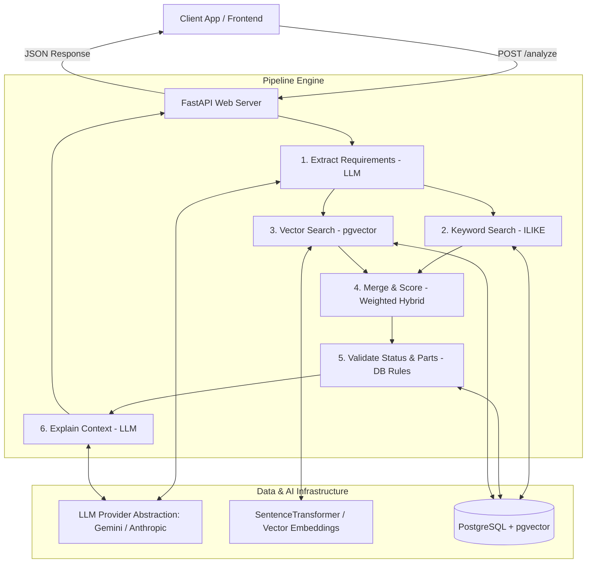
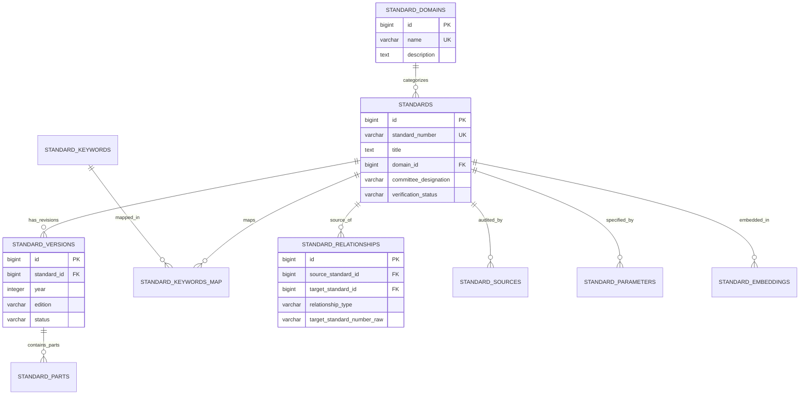
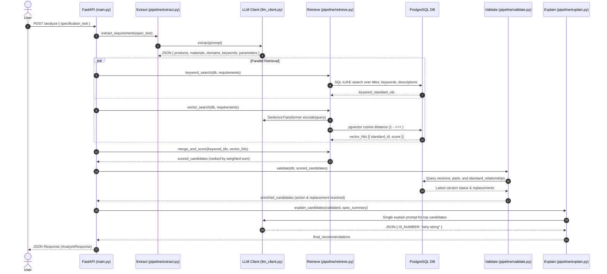

# Spec2IS — System Architecture & Technical Specification

**Project:** Spec2IS — Indian Standards (IS) Recommendation Engine Backend  
**Problem Statement:** SIH 2026 PS 26108  
**Version:** 1.0.0  
**Last Updated:** September 2026  

---

## 1. Executive Summary

**Spec2IS** is an intelligent recommendation engine that analyzes raw engineering specification texts and maps them to appropriate **Indian Standards (IS)** issued by the Bureau of Indian Standards (BIS). 

The system leverages a **hybrid 6-step recommendation pipeline** combining:
1. **LLM Requirement Extraction**: Structural decomposition of raw unstructured engineering text into domain entities, products, parameters, materials, and search terms.
2. **Hybrid Retrieval**: Dual-mode candidate retrieval combining PostgreSQL `ILIKE` keyword matching and `pgvector` cosine similarity vector search over text embeddings.
3. **Deterministic Validation**: Automated compliance checks resolving versioning recency, superseded/withdrawn statuses, multi-part ambiguity, and replacement standard linkage via explicit directional graph relationships.
4. **LLM Context Justification**: Automated creation of concise, factual explanations ("why") justifying each standard's selection against the user specification.

---

## 2. High-Level Architecture

The system is structured as a decoupled, multi-layered microservices-ready architecture:



---

## 3. Database & Data Model Architecture

The database schema is organized into three normalized tiers designed for zero row duplication, conflict preservation, and future vector/technical enrichment.



### Tier 1: Core Standard Metadata (Normalized Catalog)
* **`standard_domains`**: Standardized domain look-up table preventing domain title duplication.
* **`standards`**: The enduring identity of an Indian Standard (e.g. `IS 2190`), independent of specific publication year or edition. Includes `committee_designation` (e.g. *CED 22*).
* **`standard_versions`**: Specific edition/revision instances bound by `(standard_id, year)` unique constraint. Tracks recency and statuses (`Active`, `Withdrawn`, `Withdrawn/Superseded`).
* **`standard_parts`**: Represents multi-part standards (e.g., *Part 1*, *Part 4: Exit Requirements*) under a revision instance.
* **`standard_relationships`**: Directional graph storing revision/supersession lineages (`REVISES`, `SUPERSEDES`, `REVISED_BY`, `SUPERSEDED_BY`, `WITHDRAWN`). Supports `target_standard_number_raw` for linking external standards outside the dataset.
* **`standard_keywords` & `standard_keyword_map`**: Many-to-many indexing for fast technical keyword search.

### Tier 2: Metadata Provenance & Audit
* **`standard_sources`**: Ingestion audit trail recording source metadata (`source_name`, `source_url`, `provenance_text`) without storing large raw PDF/document bodies.

### Tier 3: Technical & Semantic Enrichment
* **`standard_parameters`**: Prepared schema for technical clause extraction (measurements, flow thresholds, operating pressures).
* **`standard_embeddings`**: Vector storage using `pgvector` (`vector(1536)` / configurable dimension) for semantic similarity search.

---

## 4. End-to-End Pipeline Architecture

The core processing engine (`pipeline/`) follows a 6-step sequential execution model:



### Detailed Pipeline Steps

#### Step 1: LLM Requirement Extraction ([`pipeline/extract.py`](file:///c:/Users/muham/Documents/4.PROJECTS/SIH/Spec2IS-backend/pipeline/extract.py))
- Sends raw specification text to the configured LLM.
- Output normalized into structured JSON fields: `products`, `materials`, `applications`, `domains`, `parameters`, `keywords`.

#### Step 2: Keyword Search ([`pipeline/retrieve.py`](file:///c:/Users/muham/Documents/4.PROJECTS/SIH/Spec2IS-backend/pipeline/retrieve.py))
- Constructs dynamic `ILIKE` conditions against `standards.title`, `standards.description`, and `standard_keywords.keyword`.
- Returns candidate `standard_id`s matching any extracted term.

#### Step 3: Vector Search ([`pipeline/retrieve.py`](file:///c:/Users/muham/Documents/4.PROJECTS/SIH/Spec2IS-backend/pipeline/retrieve.py))
- Flattens extracted requirements into a search prompt.
- Computes text embeddings using `SentenceTransformer`.
- Performs `pgvector` cosine similarity search: `score = 1 - (embedding <=> query_vec)`.

#### Step 4: Merge & Score ([`pipeline/retrieve.py`](file:///c:/Users/muham/Documents/4.PROJECTS/SIH/Spec2IS-backend/pipeline/retrieve.py))
- Combines keyword and vector hits using a weighted scoring formula:
  $$\text{Combined Score} = (w_{\text{vector}} \times \text{Vector Score}) + (w_{\text{keyword}} \times \text{Keyword Boost})$$
  *(Default weights: Vector = 0.7, Keyword = 0.3)*

#### Step 5: Validation ([`pipeline/validate.py`](file:///c:/Users/muham/Documents/4.PROJECTS/SIH/Spec2IS-backend/pipeline/validate.py))
- Fetches full record details, latest publication year, and status from `standard_versions`.
- **Status Normalization**: Maps raw statuses to `current`, `superseded`, or `withdrawn`.
- **Replacement Lookup**: Queries `standard_relationships` for `REVISES`/`SUPERSEDES` links. Resolves standard numbers via foreign keys or falls back to `target_standard_number_raw` for external standards.
- **Ambiguity Check**: Detects multi-part standards under `standard_parts` and flags `ambiguous: true` with explanatory prompts.
- **Action Determination**: Assigns action: `recommended`, `verify_replacement`, or `manual_verification`.

#### Step 6: Context Justification ([`pipeline/explain.py`](file:///c:/Users/muham/Documents/4.PROJECTS/SIH/Spec2IS-backend/pipeline/explain.py))
- Invokes LLM in a single batch call for top candidates to generate concise, 1-2 sentence justification strings (`why`).
- Includes a template fallback mechanism to guarantee 100% uptime if LLM call fails.

---

## 5. Technical Stack & Configuration

| Component | Technology / Library | Version / Details |
| :--- | :--- | :--- |
| **Web Framework** | FastAPI | `>=0.111.0` (ASGI with Uvicorn) |
| **Database Engine** | PostgreSQL + `pgvector` | PostgreSQL 14+ |
| **ORM & Driver** | SQLAlchemy (AsyncIO) + `asyncpg` | SQLAlchemy `>=2.0.30`, `asyncpg >=0.29.0` |
| **Vector Encoder** | `sentence-transformers` | `all-MiniLM-L6-v2` / PyTorch |
| **LLM Clients** | Google GenAI SDK (`google-genai`) / Anthropic SDK | Swappable via `LLM_PROVIDER` env var |
| **Data Validation** | Pydantic v2 | `>=2.7.0` |

---

## 6. API Interface Specification

### `POST /analyze`

#### Request Payload (`AnalyzeRequest`)
```json
{
  "specification_text": "Required portable fire extinguishers for electrical server room operating at 240V."
}
```

#### Response Payload (`AnalyzeResponse`)
```json
{
  "specification": "Required portable fire extinguishers for electrical server room operating at 240V.",
  "recommendations": [
    {
      "standard_number": "IS 2190",
      "version_year": "2010",
      "status": "current",
      "confidence": 0.895,
      "action": "recommended",
      "why": "IS 2190 specifies selection, installation, and maintenance of first-aid fire extinguishers suitable for electrical hazard areas.",
      "replacement_standard": null,
      "ambiguous": false,
      "ambiguity_reason": null
    }
  ],
  "areas_to_verify": []
}
```

---

## 7. Data Ingestion Architecture

Raw metadata is processed via a faithful SQL generator script ([`scripts/import_standards.py`](file:///c:/Users/muham/Documents/4.PROJECTS/SIH/Spec2IS-backend/scripts/import_standards.py)):

```
[Raw Metadata TXT] ---> scripts/import_standards.py ---> [db/sql/seed_data.sql] ---> [PostgreSQL DB]
```

- **Idempotency**: All SQL statements use `ON CONFLICT DO UPDATE` or `ON CONFLICT DO NOTHING`.
- **Relationship Resolution**: Linkages between version years and target standards are resolved safely without foreign key breakages.
